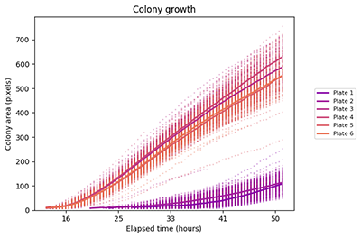
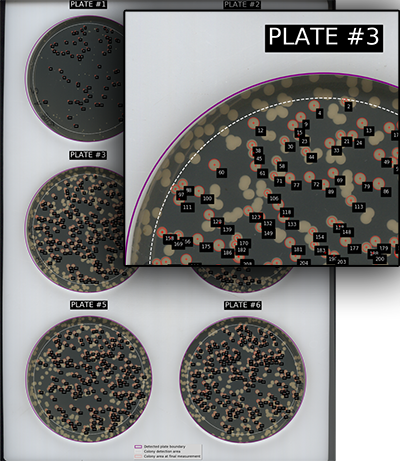

[](https://pypi.org/project/colonyscanalyser/) [](https://snyk.io//test/github/Erik-White/ColonyScanalyser?targetFile=requirements.txt) [](https://github.com/Erik-White/ColonyScanalyser/blob/master/LICENSE)

# ColonyScanalyser

An image analysis tool for measuring microorganism colony growth.

ColonyScanalyser will analyse and collate statistical data from agar plate images. It provides fast, high-throughput image processing.



ColonyScanalyser can provide information on:
* Colony appearance time
* Growth parameters (lag time, rate, carrying capacity)
* Growth and appearance time distribution
* Colony colour (e.g. staining or other visual indicators)

ColonyScanalyser is suitable for analysing series of images from a fixed point that show the development of microorganism colonies over time.

Several image plots will be output after analysis is complete to enable quick verification of the data. A complete set of data is provided in CSV format for further study.

## Getting Started

* Install the [prerequisites](#prerequisites) and [package](#installing)
* Locate your image series in a folder e.g. `/user/images/series1`
* Run the analysis using ColonyScanalyser
```
scanalyser /user/images/series1
```

There are various command line arguments that can alter the way the package is run. To see a list of arguments and information on each, run the command
```
scanalyser --help
```

### Documentation
A full set of documentation is available at https://erik-white.github.io/ColonyScanalyser/

### Prerequisites
ColonyScanalyser requires Python version 3.7 or greater, and the Pip package manager. Pip is included with Python version 3.4 and up.

The remaining Python package dependencies are automatically handled by Pip when installing the Colonyscanalyser package.



Optionally use a virtual environment, such as [Pipenv](https://github.com/pypa/pipenv), or a [containerised instance of the package](https://hub.docker.com/r/erikwhite/colonyscanalyser).

For testing:
* [Pytest](https://pytest.org/)
* [Pytest-cov](https://github.com/pytest-dev/pytest-cov/)

### Installing

#### Using pip
```
pip install colonyscanalyser
```

#### From github (requires [git](https://git-scm.com/) install)
```
git clone https://github.com/erik-white/colonyscanalyser.git
cd colonyscanalyser
pip install -e .
```

## Testing

Install the package with the extra test packages:
`pip install colonyscanalyser[test]`

Run the tests:
`pytest --cov colonyscanalyser`

## Contributing

Please read the [contribution guidelines](docs/CONTRIBUTING.md) for details on our code of conduct, and the process for submitting pull requests to us.

## Versioning

We use [SemVer](http://semver.org/) for versioning. For the versions available, see the [releases](https://github.com/Erik-White/ColonyScanalyser/releases).

## License

This project is licensed under the GPLv3 - see the [licence](LICENSE) file for details

## Acknowledgments

* Levin-Reisman et al. for [their work](https://www.ncbi.nlm.nih.gov/pubmed/20676109) developing the ScanLag technique
* [Fabio Zanini](https://github.com/iosonofabio/) for his original attempts at a Python implementation