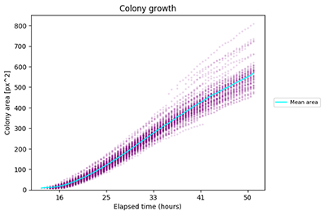

# ScanLag

An image analysis tool for measuring microorganism colony growth.

ScanLag will analyse and collate statistical data from cell-culture plate images. It requires a series of images from a fixed point that show the development of microorganism colonies over time.


ScanLag can provide information on:
* Colony growth lag time (time of appearance)
* Bimodal lag time distribution (comparing lag times of two colonies)
* Colony area growth over time

By default, it will output a set of data and plots that summarize the information from all the plates in the image series. If you require further detail, such as plots of each individual plate, you can increase the `save_plots` command line argument.

## Getting Started

* Install the [prerequisites](#prerequisites) and [package](#installing)
* Locate your image series in a folder e.g. `\user\images\series1`
* Run the analysis using ScanLag `python scanlag \user\images\series1`

There are various command line arguments that can alter the way the package is run. To see a list of arguments and information on each, run the command `python scanlag --help`

For example, to run the package 'silently' with no console output: `python scanlag \user\images\series1 --verbose 0`

### Prerequisites

* [Python](https://www.python.org/) >=3.7
* [Scikit-image](https://scikit-image.org/) >=0.15

Optionally use a virtual environment, such as [Pipenv](https://github.com/pypa/pipenv).

For testing:
* [Pytest](https://pytest.org/)
* [Pytest-cov](https://github.com/pytest-dev/pytest-cov/)

### Installing

####Using pip
Install Scikit-image (unless already installed)
`pip install scikit-image`
Install ScanLag
`pip install scanlag`

####From github (requires [git](https://git-scm.com/) install)
```
git clone https://github.com/erik-white/scanlag.git
cd scanlag
pip install -e .
```

## Testing

Install the package with the extra test packages:
`pip install scanlag[test]`

Run the tests:
`python pytest --cov scanlag`

## Contributing

Please read [CONTRIBUTING.md](docs/CONTRIBUTING.md) for details on our code of conduct, and the process for submitting pull requests to us.

## Versioning

We use [SemVer](http://semver.org/) for versioning. For the versions available, see the [tags on this repository](https://github.com/your/project/tags).

## License

This project is licensed under the GPLv3 - see the [LICENSE.md](LICENSE.md) file for details

## Acknowledgments

* Levin-Reisman et al. for [their work](https://www.ncbi.nlm.nih.gov/pubmed/20676109) developing the ScanLag technique
* [Fabio Zanini](https://github.com/iosonofabio/) for his original attempts at a Python implementation
