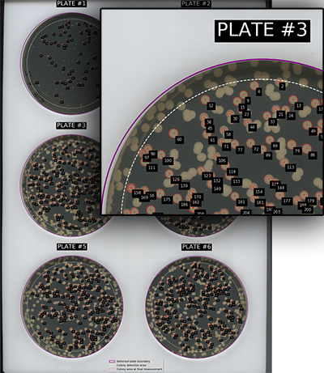

# Example output
A few simple plots are saved to allow quick comparison of the different plates. Increasing the `plots` argument will increase the number and detail of plots that are output, see the [command line arguments](command_line_arguments.md) for more detail.

Data such as colony area, colour, time of appearance etc is output to a set of CSV files. Growth curve fitting with the Gompertz function is attempted for each colony and this data is provided where fitting is possible.



## Plate identification
Plates are numbered sequentially, starting from the top left and proceeding in rows. On a 3 x 2 lattice the plate numbers will be:
```
1   2

3   4

5   6
```
A 'map' of the identified plates and colonies will be output to show how they have been identified. This can be useful for correlating data from individual colonies with the specific colony on the plate. Note that colonies are shown at their final measurement size, which may be smaller than the colony in the image. Measurements are stopped if colonies merge, or if they do not meet other criteria e.g. they display low circularity.

## Plots
At the default level, a few comparison plots are output to the `plots` folder in your image folder. These allow quick verification and comparison of the data.

Individual plots for each plate are also saved, this includes growth curves fitted with the Gompertz function (where fitting is successful).


At the highest level of `plots`, a separate animated gif image of each plate is output. This may be useful for viewing the progression of colonies through their growth period, as well as for comparing growth in differing plate conditions.

Only the measured plate area is shown in the animations. The area defined by `plate_edge_cut` is excluded.

## Data
All the data gathered during analysis is output to the `data` folder in your images folder. Data is output as CSV files which is compatible with almost all data packages.

Summarised data of all plates is saved as `plates_summary.csv`

Additionally, data is collated in two files for each plate, one with aggregate data for each colony and another with colony data at every image time point:

```
plate1_colonies.csv
plate1_colony_timepoints.csv
plate2_colonies.csv
plate2_colony_timepoints.csv
plate3_colonies.csv
plate3_colony_timepoints.csv
...
```

A single compressed data file, `processed_data.xz`, is also saved. This contains all the data objects from analysis and can be used by the package to quickly recreate the plots and data files.