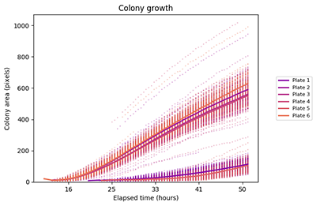
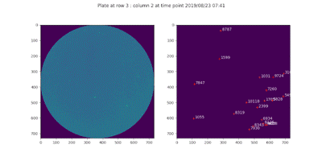

# ColonyScanalyser

An image analysis tool for measuring microorganism colony growth.
ColonyScanalyser will analyse and collate statistical data from cell-culture plate images.
 It provides fast, high-throughput image processing.

ColonyScanalyser can provide information on:

* Colony appearance time
* Colony growth over time
* Growth and appearance time distribution (comparing colonies under different conditions)

## Install
```
pip install colonyscanalyser
```
Full [installation instructions](installation.md).

## Run
```
scanalyser /path/to/images
```
See the [quick start guide](quick_start.md) for more information on getting up and running with ColonyScanalyser.


## Image requirements
ColonyScanalyser is suitable for analysing series of images from a fixed point that show the development of microorganism colonies over time. The [image specifications page](image_specifications.md) has more detail on image requirements.

Several image plots will be output after analysis is complete to enable quick verification of the data. A complete set of data is provided in CSV format for further study.

## License
This project is licensed under the GPLv3 - see the [license](LICENSE.md) page for details