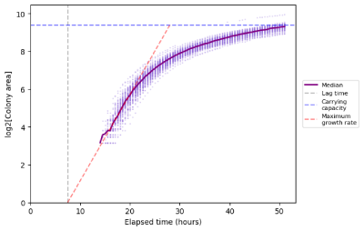

# ColonyScanalyser

An image analysis tool for measuring microorganism colony growth.

ColonyScanalyser will analyse and collate statistical data from cell-culture plate images. It requires a series of images from a fixed point that show the development of microorganism colonies over time.



ColonyScanalyser can provide information on:

* Colony growth lag time (time of appearance)
* Bimodal lag time distribution (comparing lag times of two colonies)
* Colony area growth over time

By default, it will output a set of data and plots that summarize the information from all the plates in the image series. If you require further detail, such as plots of each individual plate, you can increase the `save_plots` command line argument.

## Getting Started

* Install the [prerequisites](#prerequisites) and [package](#installing)
* Locate your image series in a folder e.g. `\user\images\series1`
* Run the analysis using ColonyScanalyser `scanalyser \user\images\series1`

There are various command line arguments that can alter the way the package is run. To see a list of arguments and information on each, run the command `scanalyser --help`

For example, to run the package 'silently' with no console output: `scanalyser \user\images\series1 --verbose 0`

## Prerequisites

* [Python](https://www.python.org/) >=3.7
* [Scikit-image](https://scikit-image.org/) >=0.15

Optionally use a virtual environment, such as [Pipenv](https://github.com/pypa/pipenv).

## Installing

#### Using pip
Install Scikit-image (unless already installed)
```
pip install scikit-image
```

Install ColonyScanalyser
```
pip install colonyscanalyser
```

#### From github (requires [git](https://git-scm.com/) install)
```
git clone https://github.com/erik-white/colonyscanalyser.git
cd colonyscanalyser
pip install -e .
```